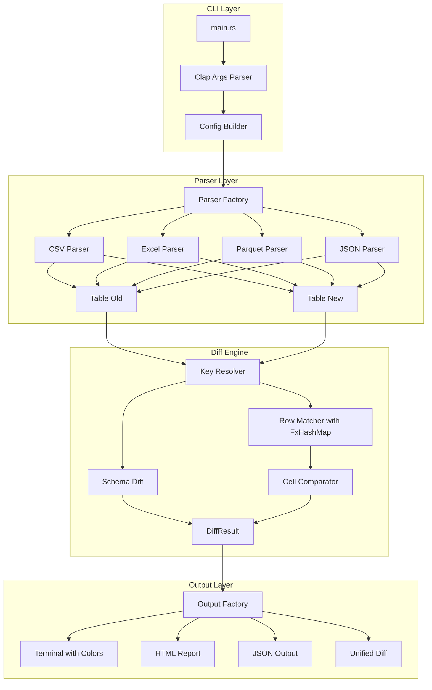

# Rust Tabular Diff Tool (`datadiff`)

A high-performance CLI tool for semantic diffing of tabular data files with native Git integration.

---

## Project Structure

```
datadiff/
├── Cargo.toml
├── src/
│   ├── main.rs              # CLI entry point
│   ├── lib.rs               # Library exports
│   ├── config.rs            # Configuration handling
│   ├── parser/
│   │   ├── mod.rs           # Parser trait and factory
│   │   ├── csv.rs           # CSV parser
│   │   ├── excel.rs         # Excel (.xlsx, .xls) parser
│   │   ├── parquet.rs       # Parquet parser
│   │   └── json.rs          # JSON array parser
│   ├── model/
│   │   ├── mod.rs
│   │   ├── table.rs         # Table, Row, Cell structures
│   │   ├── schema.rs        # Column metadata
│   │   └── key.rs           # Primary key handling
│   ├── diff/
│   │   ├── mod.rs           # Diff engine
│   │   ├── schema_diff.rs   # Schema comparison
│   │   ├── row_diff.rs      # Row matching algorithm
│   │   └── cell_diff.rs     # Cell-level comparison
│   ├── output/
│   │   ├── mod.rs           # Output trait
│   │   ├── terminal.rs      # Colored terminal output
│   │   ├── html.rs          # HTML report
│   │   ├── json.rs          # JSON output
│   │   └── unified.rs       # Git-style unified diff
│   └── git/
│       ├── mod.rs
│       └── driver.rs        # Git diff driver mode
├── tests/
│   ├── csv_tests.rs
│   ├── excel_tests.rs
│   └── integration_tests.rs
└── README.md
```

---

## Core Dependencies (Cargo.toml)

```toml
[package]
name = "datadiff"
version = "0.1.0"
edition = "2021"
description = "Semantic diff for tabular data (CSV, Excel, Parquet, JSON)"
license = "MIT"

[dependencies]
# CLI
clap = { version = "4", features = ["derive"] }

# Parsing
csv = "1.3"                           # CSV parsing
calamine = "0.24"                     # Excel (.xlsx, .xls, .ods)
parquet = { version = "53", features = ["arrow"] }  # Parquet
arrow = "53"                          # Arrow columnar format
serde = { version = "1", features = ["derive"] }
serde_json = "1"                      # JSON

# Data structures
indexmap = "2"                        # Ordered hash maps
rustc-hash = "2"                      # Fast hashing (FxHash)

# Output
termcolor = "1"                       # Cross-platform colored output
tabled = "0.16"                       # Pretty tables
tera = "1"                            # HTML templating

# Utilities
thiserror = "2"                       # Error handling
anyhow = "1"                          # Error propagation
rayon = "1"                           # Parallel processing

[dev-dependencies]
tempfile = "3"
assert_cmd = "2"
predicates = "3"
```

---

## Architecture



---

## Key Data Structures

### Table Model

```rust
// src/model/table.rs

use indexmap::IndexMap;
use std::borrow::Cow;

#[derive(Debug, Clone, PartialEq)]
pub enum CellValue {
    Null,
    Bool(bool),
    Int(i64),
    Float(f64),
    String(Cow<'static, str>),
    Date(chrono::NaiveDate),
    DateTime(chrono::NaiveDateTime),
}

#[derive(Debug, Clone)]
pub struct Column {
    pub name: String,
    pub index: usize,
    pub inferred_type: CellType,
}

#[derive(Debug)]
pub struct Row {
    pub cells: Vec<CellValue>,
    pub key: String,           // Computed composite key
    pub key_hash: u64,         // Pre-computed hash for O(1) lookup
    pub source_line: usize,    // Original line number
}

#[derive(Debug)]
pub struct Table {
    pub columns: Vec<Column>,
    pub rows: Vec<Row>,
    pub key_columns: Vec<usize>,
    pub row_index: IndexMap<u64, usize>,  // hash -> row index
}
```

### Diff Result

```rust
// src/diff/mod.rs

#[derive(Debug)]
pub enum SchemaChange {
    ColumnAdded { name: String, index: usize },
    ColumnRemoved { name: String, index: usize },
    ColumnRenamed { old: String, new: String, index: usize },
    ColumnMoved { name: String, from: usize, to: usize },
}

#[derive(Debug)]
pub struct CellChange {
    pub column: String,
    pub old_value: CellValue,
    pub new_value: CellValue,
}

#[derive(Debug)]
pub enum RowChange {
    Added { key: String, row: Row },
    Removed { key: String, row: Row },
    Modified { key: String, changes: Vec<CellChange> },
}

#[derive(Debug)]
pub struct DiffResult {
    pub schema_changes: Vec<SchemaChange>,
    pub row_changes: Vec<RowChange>,
    pub stats: DiffStats,
}

#[derive(Debug, Default)]
pub struct DiffStats {
    pub rows_added: usize,
    pub rows_removed: usize,
    pub rows_modified: usize,
    pub cells_changed: usize,
    pub old_row_count: usize,
    pub new_row_count: usize,
}
```

---

## CLI Interface

```bash
# Basic usage
datadiff old.csv new.csv

# Specify key columns
datadiff old.csv new.csv --key=id
datadiff old.csv new.csv --key=name,date

# Output formats
datadiff old.csv new.csv --format=terminal   # (default)
datadiff old.csv new.csv --format=json
datadiff old.csv new.csv --format=html > diff.html
datadiff old.csv new.csv --format=unified    # Git-style

# Git diff driver mode
datadiff --git-driver old.csv old_hex old_mode new.csv new_hex new_mode

# Options
datadiff old.csv new.csv --ignore-case
datadiff old.csv new.csv --numeric-tolerance=0.001
datadiff old.csv new.csv --ignore-whitespace
datadiff old.csv new.csv --ignore-column=timestamp
datadiff old.csv new.csv --sort-by=id         # Normalize order before diff

# Excel specific
datadiff old.xlsx new.xlsx --sheet="Sales Data"

# Summary only
datadiff old.csv new.csv --stats-only
```

---

## Git Integration

### Setup as External Diff Driver

```bash
# Install
cargo install datadiff

# Configure Git
git config --global diff.csv.command "datadiff --git-driver"
git config --global diff.xlsx.command "datadiff --git-driver"

# Add to .gitattributes
echo "*.csv diff=csv" >> .gitattributes
echo "*.xlsx diff=xlsx" >> .gitattributes
```

### Git Driver Mode Implementation

```rust
// src/git/driver.rs

pub fn run_git_driver(args: &GitDriverArgs) -> Result<()> {
    // Git calls: tool old_file old_hex old_mode new_file new_hex new_mode
    let old_table = parse_file(&args.old_file)?;
    let new_table = parse_file(&args.new_file)?;
    
    let diff = compute_diff(&old_table, &new_table, &args.config)?;
    
    // Output in unified format for git
    let output = UnifiedOutput::new();
    output.render(&diff, &mut std::io::stdout())?;
    
    Ok(())
}
```

---

## Performance Optimizations

| Optimization | Technique |
|--------------|-----------|
| Hashing | Use `FxHashMap` (rustc-hash) - 2x faster than std HashMap |
| Parallel parsing | Use `rayon` for large files |
| Memory | Use `Cow<str>` to avoid allocations for unchanged strings |
| Streaming | For huge files, stream rows instead of loading all into memory |
| Pre-computed hashes | Hash keys once during parsing |

---

## Implementation Phases

### Phase 1: Core Infrastructure

- Project setup with Cargo
- CLI argument parsing with clap
- CSV parser implementation
- Basic table model

### Phase 2: Diff Engine

- Schema diff algorithm
- Row matching with hash maps
- Cell comparison logic
- Numeric tolerance handling

### Phase 3: Output Formats

- Colored terminal output
- JSON output for programmatic use
- Unified diff format for Git

### Phase 4: Extended Format Support

- Excel parser (calamine)
- Parquet parser (arrow-rs)
- JSON array parser

### Phase 5: Git Integration

- Git diff driver mode
- Installation scripts
- Documentation

### Phase 6: Advanced Features

- HTML report generation
- Parallel processing for large files
- Fuzzy row matching option

---

## Example Output

```
━━━━━━━━━━━━━━━━━━━━━━━━━━━━━━━━━━━━━━━━━━━━━━━━━━━━━━━━━━━━━━━━
 datadiff: sales_q1.csv → sales_q2.csv
━━━━━━━━━━━━━━━━━━━━━━━━━━━━━━━━━━━━━━━━━━━━━━━━━━━━━━━━━━━━━━━━

Schema Changes:
  + discount_rate (new column at position 5)

Summary: +2 added, -1 removed, ~5 modified (out of 150 rows)

Added Rows:
┌────────────┬─────────────────┬─────────┬──────────┐
│ product_id │ name            │ price   │ quantity │
├────────────┼─────────────────┼─────────┼──────────┤
│ SKU-201    │ "New Widget"    │ 29.99   │ 100      │
│ SKU-202    │ "Super Gadget"  │ 149.99  │ 50       │
└────────────┴─────────────────┴─────────┴──────────┘

Removed Rows:
┌────────────┬─────────────────┬─────────┬──────────┐
│ product_id │ name            │ price   │ quantity │
├────────────┼─────────────────┼─────────┼──────────┤
│ SKU-001    │ "Old Product"   │ 19.99   │ 0        │
└────────────┴─────────────────┴─────────┴──────────┘

Modified Rows:
  SKU-042:
    price: 29.99 → 34.99 (+16.7%)
    quantity: 100 → 85 (-15.0%)
  
  SKU-108:
    name: "Gadget v1" → "Gadget v2"
```

---

## Next Steps

Ready to implement? Start with:

1. Initialize Rust project with `cargo new datadiff`
2. Set up `Cargo.toml` with dependencies
3. Implement CLI structure with clap
4. Build CSV parser and table model
5. Implement core diff algorithm

Shall I proceed with implementation?
